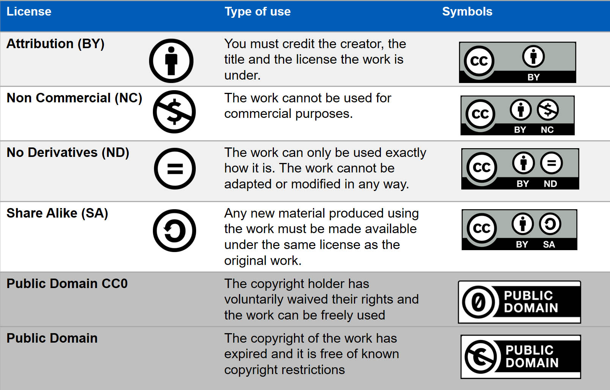

How to choose a license
=======================
..
    Choosing a proper open license is one of the most important things when creating OER. You should also consider to choose different licenses for text passages and source code. 
    This can be helpful to people wanting to use your code in their own projects and other contexts than your notebook collection, as licenses like CC-BY can hinder certain usages due to its `copyleft`_ behaviour.

    .. _copyleft: https://de.wikipedia.org/wiki/Copyleft

General Information
------------------------

The Importance of (Open) Licensing
^^^^^^^^^^^^^^^^^^^^^^^^^^^^^^^^^^

Open licensing is essential to the success and broad accessibility of OER. By utilizing open licenses, 
creators and educators grant permission for their works to be freely used, modified, and shared under predefined terms. 
This openness accelerates progress, as others can build upon existing work, adapt it to new contexts, and contribute back to the community. 

Different Licenses for Texts and Code
^^^^^^^^^^^^^^^^^^^^^^^^^^^^^^^^^^^^^

When creating OER in Jupyter Notebooks, it's important to recognize that different types of content—such as text and code—require distinct licensing. 
Text-based content is typically covered by licenses like `Creative Commons`_ (CC). 
On the other hand, code is generally licensed under open source licenses, which focus on issues pertinent to software. 
Ensuring that each type of content is appropriately licensed supports both legal clarity and the effective reuse of educational resources. 
Thus, the CC-licenses and different types of open source licenses are presented in the following paragraphs.

Overview of Common Open Licenses
--------------------------------

Licenses for Texts (Creative Commons)
^^^^^^^^^^^^^^^^^^^^^^^^^^^^^^^^^^^^^

Introduction to Creative Commons
""""""""""""""""""""""""""""""""
Creative Commons (CC) is a set of standardised licence features designed to facilitate the sharing and use of creative works while allowing creators to retain their rights. 
CC licenses have become a popular choice due to their clarity, ease of use, and compatibility with national copyright laws around the world.
The CC system offers various license types that enable creators to grant specific usage rights – ranging from full sharing permissions to more restrictive options that limit certain uses.

Understanding CC Modules
""""""""""""""""""""""""

CC licenses consist of modular components. These are represented by abbreviations or icons, which quickly indicate the usage rights granted for the data. 
The `'Open Publishing Guide for Authors'`_ by the University of Southern Queensland (2023) provides a clear explanation of these modules, illustrated through a helpful graphic.

    Source: University of Southern Queensland 2023: https://usq.pressbooks.pub/openpublishingguideforauthors/chapter/understanding-open-licences/

Licenses for Code (Open Source Licenses)
^^^^^^^^^^^^^^^^^^^^^^^^^^^^^^^^^^^^^^^^

Introduction to Open Source Licenses
""""""""""""""""""""""""""""""""""""

Open source licenses are legal frameworks that grant users the freedom to use, modify, and distribute software without significant restrictions. 
The `Open Source Initiative`_ has defined the key features that free licenses have in common: 

- free distribution of the software 
- free access to the source code of the software 
- permission to modify and redistribute 
- No discrimination against different licensees
- none of the content-related restrictions regarding usage

Despite the shared principles of open source licenses, the obligations for licensees can vary considerably. 
The central difference here is whether and to what extent further developments of the software must be distributed under the same license, known as copyleft. 
Copyleft implies that further developments of the software may only be published under the same license terms as the original license in order to ensure that open source software and its progress remain freely accessible. 
In contrast, licenses without copyleft effects allow the authors of modified software to decide for themselves under which conditions they wish to publish their works.

Different Open Source License Types
""""""""""""""""""""""""""""""""""""

The framework for categorization of open source license types is based on the publication "Rechtsfragen bei Open Science" by Kreutzer und Lahmann (2021).

Licenses without copyleft:
    Licenses without copyleft effect grant the licensee all the freedoms of an open source license and do not impose any requirements on the license type for modified versions of the software. 
    The licensee can therefore redistribute modified versions of the software under any license conditions. 
    Examples of this are the `BSD`_, `MIT`_ and `APACHE`_ licenses.

Licenses with limited copyleft: 
    Licenses with limited copyleft make it easier for users to combine open source software with other software, including proprietary software. 
    This is particularly useful for users who develop their own components and do not want to place them completely under the original license. 
    Examples of such licenses are the `MPL`_ and `LGPL`_ licenses.

Licenses with a strict copyleft:
    Licenses with a strict copyleft oblige the licensee to distribute all modified or derived works exclusively under the original license. 
    A prominent example of this is the `GPL`_ license.

Practical Tools for Choosing the Right License
^^^^^^^^^^^^^^^^^^^^^^^^^^^^^^^^^^^^^^^^^^^^^^

To choose the appropriate CC license, you can identify the suitable license combination by answering some key questions (see infographic below) or by using the `Creative Commons License Chooser`_. 
This tool will help you choose a license that meets your criteria. For software licensing, you can use the `License Selector`_. 
Both tools are user-friendly and help to define the legal framework to ensure that your OER are used in accordance with your preferences.

.. figure:: data/choose_cc.png
    :width: 90%
    :align: center

    Source: Based on the on the work “Welche CC-Lizenz ist die richtige für mich?” Barbara Klute und Jöran Muuß-Merholz for wb-web licensed under CC BY SA 3.0. 
    The English version is a translation and enhancement by Jöran Muuß-Merholz under the same license:
    https://tu-dresden.de/gsw/ressourcen/dateien/bereich-gsw/virtuelle-lehre/TdL23_OER_engl-blau.pdf?lang=de

How to introduce a license (or two) to your project
-----------------------------------------------------

After you have chosen a license model that fits your project and your preferences, all you have to do is include a file named :code:`LICENSE` in your project files. 
This file should contain the full texts of all licenses you want to use.
You should also state whom the copyright is attributed to and under what license(s) in your meterials, for example in every notebook as a foot note and in the readme file for your repository.

Links and Literature
---------------------

Creative Commons „Frequently Asked Questions“ https://creativecommons.org/faq/

JR Dingwall. Remixing CC Licensed Work. University of Saskatchewan 	https://openpress.usask.ca/creativecommons/chapter/remixing-cc-licensed-work/

Kreutzer, T., und H. Lahmann. 2021. Rechtsfragen bei Open Science. Hamburg University Press. https://doi.org/10.15460/HUP.211. 

Open Economics Guide. Publish OER Under an Appropriate Licence. 	https://openeconomics.zbw.eu/en/knowledgebase/publish-oer-under-an-appropriate-licence/ 

The OGRepository. 2012. Creating OER and Combining Licenses. 	https://www.youtube.com/watch?v=Hkz4q2yuQU8 

.. _Creative Commons: https://creativecommons.org
.. _'Open Publishing Guide for Authors': https://usq.pressbooks.pub/openpublishingguideforauthors/chapter/understanding-open-licences/
.. _Open Source Initiative: https://opensource.org/osd
.. _BSD: https://www.freebsd.org/copyright/freebsd-license/
.. _MIT: https://spdx.org/licenses/MIT.html#licenseText
.. _APACHE: https://www.apache.org/licenses/LICENSE-2.0.html
.. _MPL: https://www.mozilla.org/en-US/MPL/2.0/
.. _LGPL: https://www.gnu.org/licenses/lgpl-3.0.html
.. _GPL: https://www.gnu.org/licenses/gpl-3.0.html
.. _Creative Commons License Chooser: https://chooser-beta.creativecommons.org/
.. _License Selector: https://ufal.github.io/public-license-selector/