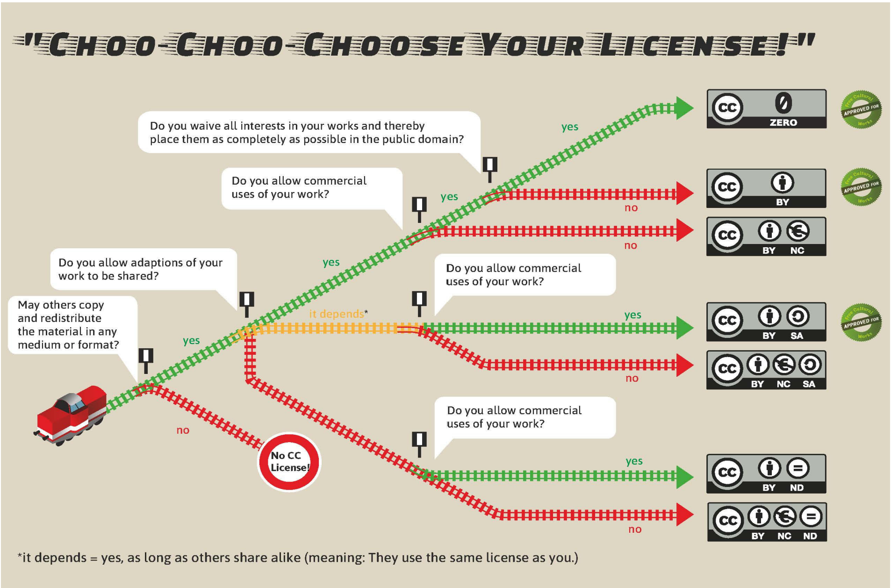

How to choose a license
=======================
..
    Choosing a proper open license is one of the most important things when creating OER. You should also consider to choose different licenses for text passages and source code. 
    This can be helpful to people wanting to use your code in their own projects and other contexts than your notebook collection, as licenses like CC-BY can hinder certain usages due to its `copyleft`_ behaviour.

    .. _copyleft: https://de.wikipedia.org/wiki/Copyleft

General Information
------------------------

The Importance of (Open) Licensing
^^^^^^^^^^^^^^^^^^^^^^^^^^^^^^^^^^

Open licensing is essential to the success and broad accessibility of OER. 
By utilizing open licenses, creators and educators grant permission for their works to be freely used, modified, and shared under predefined terms. 
This openness accelerates progress, as others can build upon existing work, adapt it to new contexts, and contribute back to the community. 

Different Licenses for Texts and Code
^^^^^^^^^^^^^^^^^^^^^^^^^^^^^^^^^^^^^

When creating OER in Jupyter Notebooks, it's important to recognize that different types of content—such as text and code—require distinct licensing. 
Text-based content is typically covered by licenses like Creative Commons (CC). 
On the other hand, code is generally licensed under open source licenses, which focus on issues pertinent to software. 
Ensuring that each type of content is appropriately licensed supports both legal clarity and the effective reuse of educational resources. 
Thus, the CC-licenses and different types of open source licenses are presented in the following paragraphs.

Overview of Common Open Licenses
--------------------------------

Licenses for Texts (Creative Commons)
^^^^^^^^^^^^^^^^^^^^^^^^^^^^^^^^^^^^^

Introduction to Creative Commons
""""""""""""""""""""""""""""""""
An overview of the Creative Commons (CC) framework.
**!TBC...!**

Understanding CC Modules
""""""""""""""""""""""""

Explanation of different CC licenses (e.g., CC BY, CC BY-SA) and their specific terms.
**!TBC...!**

Licenses for Code (Open Source Licenses)
^^^^^^^^^^^^^^^^^^^^^^^^^^^^^^^^^^^^^^^^

Introduction to Open Source Licenses
""""""""""""""""""""""""""""""""""""

Open source licenses are legal frameworks that grant users the freedom to use, modify, and distribute software without significant restrictions. 
The `Open Source Initiative`_ has defined the key features that free licenses have in common: 

- free distribution of the software 
- free access to the source code of the software 
- permission to modify and redistribute 
- No discrimination against different licensees
- none of the content-related restrictions regarding usage

Despite the shared principles of open source licenses, the obligations for licensees can vary considerably. 
The central difference here is whether and to what extent further developments of the software must be distributed under the same license, known as copyleft. 
Copyleft implies that further developments of the software may only be published under the same license terms as the original license in order to ensure that open source software and its progress remain freely accessible. 
In contrast, licenses without copyleft effects allow the authors of modified software to decide for themselves under which conditions they wish to publish their works.

Different Open Source License Types
""""""""""""""""""""""""""""""""""""

The framework for categorization of open source license types is based on the publication "Open Source Software: Rechtliche Rahmenbedingungen der Freien Software" by Jaeger and Metzger (2020).

Licenses without copyleft:
    Licenses without copyleft effect grant the licensee all the freedoms of an open source license and do not impose any requirements on the license type for modified versions of the software. 
    The licensee can therefore redistribute modified versions of the software under any license conditions. 
    Examples of this are the BSD, MIT and APACHE licenses.

Licenses with limited copyleft: 
    These licenses also contain a copyleft effect, which is not applied to all modifications and derivative works, but allows certain exceptions. 
    Examples of such licenses are the MPL and the LGPL.

Licenses with a strict copyleft:
    Licenses with a strict copyleft effect oblige the licensee to ensure that all derivative works are redistributed exclusively under the original license. 
    A prominent example of this is the GPL.

Practical Tools for Choosing the Right License
^^^^^^^^^^^^^^^^^^^^^^^^^^^^^^^^^^^^^^^^^^^^^^

https://tu-dresden.de/gsw/ressourcen/dateien/bereich-gsw/virtuelle-lehre/TdL23_OER_engl-blau.pdf?lang=de

**!TODO: formatting + descriptions!**

Choose a License (creativecommons.org)

License Selector (ufal.github.io)

How to introduce a license (or two) to your project
-----------------------------------------------------

After you have chosen a license model that fits your project and your preferences, all you have to do is include a file named :code:`LICENSE` in your project files. This file should contain the full texts of all licenses you want to use.
You should also state whom the copyright is attributed to and under what license(s) in your meterials, for example in every notebook as a foot note and in the readme file for your repository.

Links and Literature
---------------------

Creative Commons „Frequently Asked Questions“ https://creativecommons.org/faq/

JR Dingwall, University of Saskatchewan „Remixing CC Licensed Work“ https://openpress.usask.ca/creativecommons/chapter/remixing-cc-licensed-work/

.. _Open Source Initiative: https://opensource.org/osd